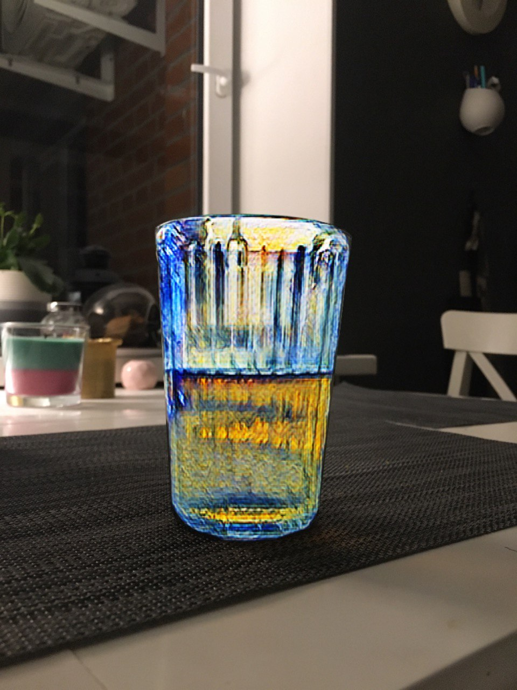
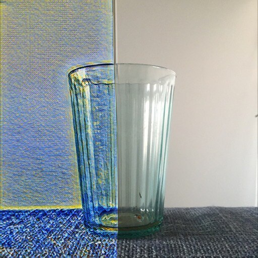
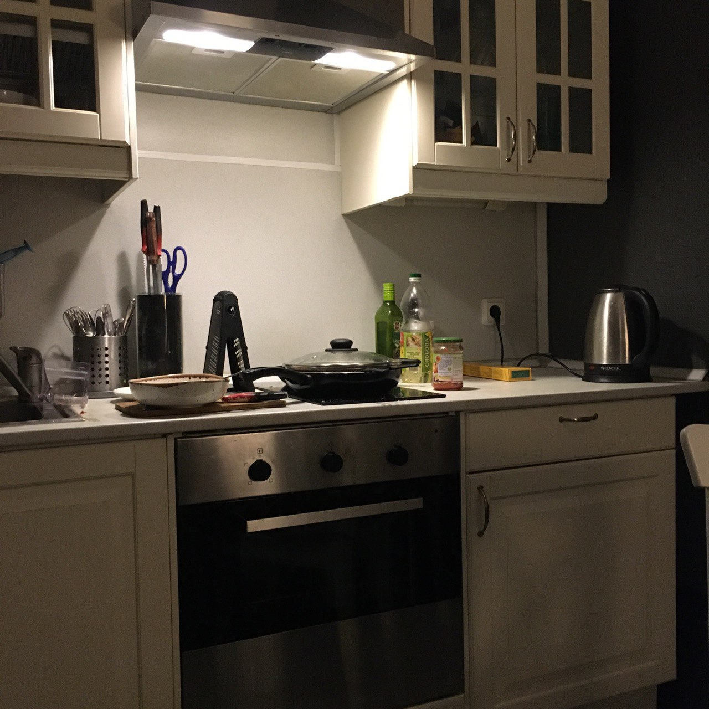
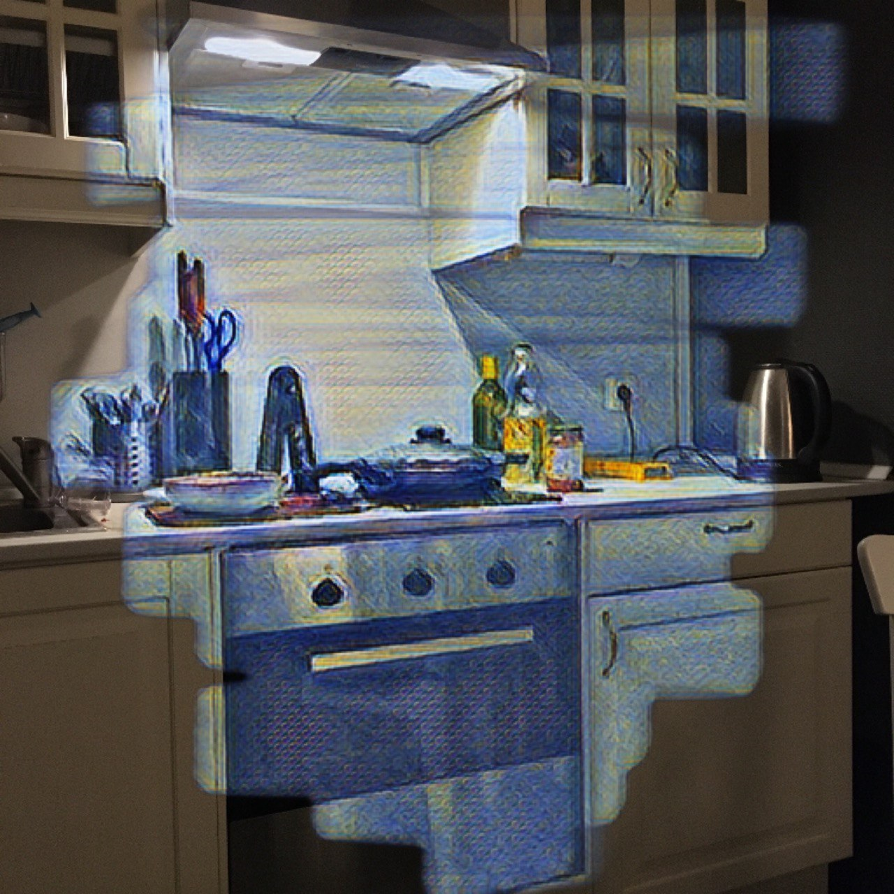
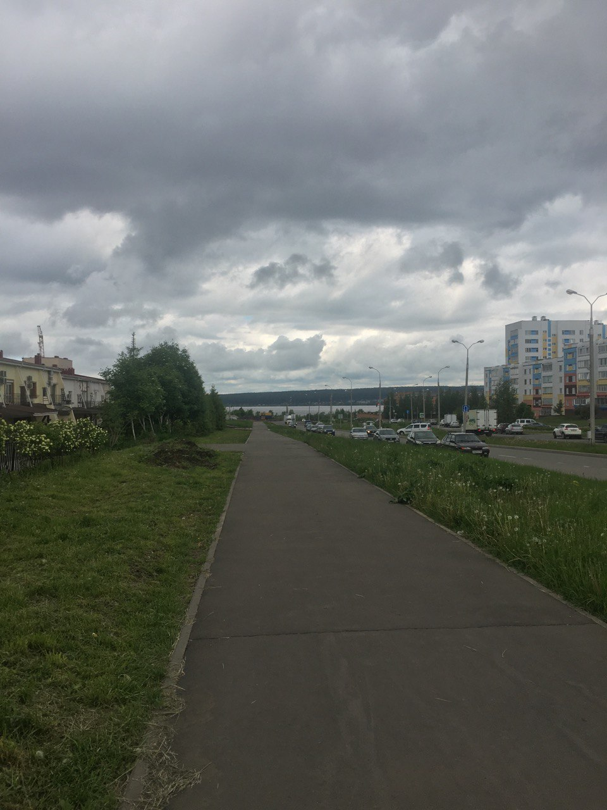
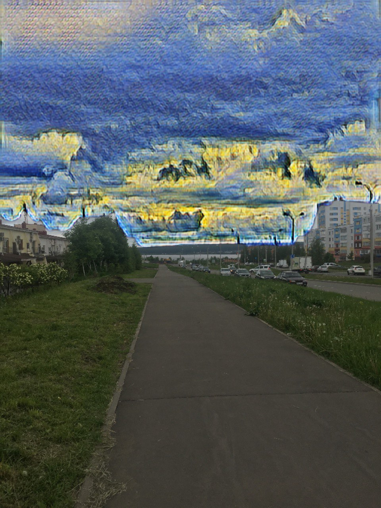

# TransartistryApp

TransartistryApp is an application that will allow you to transform your photos and images into paintings of great artists.

## Description

You decide which part needs to be converted. 
1. You select/paint over the area with your finger/stylus on the photo that needs to be converted to the style of the selected artist. 
2. Choose a style
3. Profit

The application will provide several default styles, and will also make it possible to download new styles that will be located on Firebase/Storage

How it will look like: https://www.figma.com/file/AhgWOn3NGv9S1rrAOeggum/TransartistryApp?node-id=0%3A1

Architecture: Clean Swift (VIP). iOS 15.2, XCode 13.2.1

## Examples of usage
Before and after painting and implementing style
1. A Glass(accurate selection)

2. A Glass(inaccurate selection)

3. Kitchen
 
4. Sky
 
